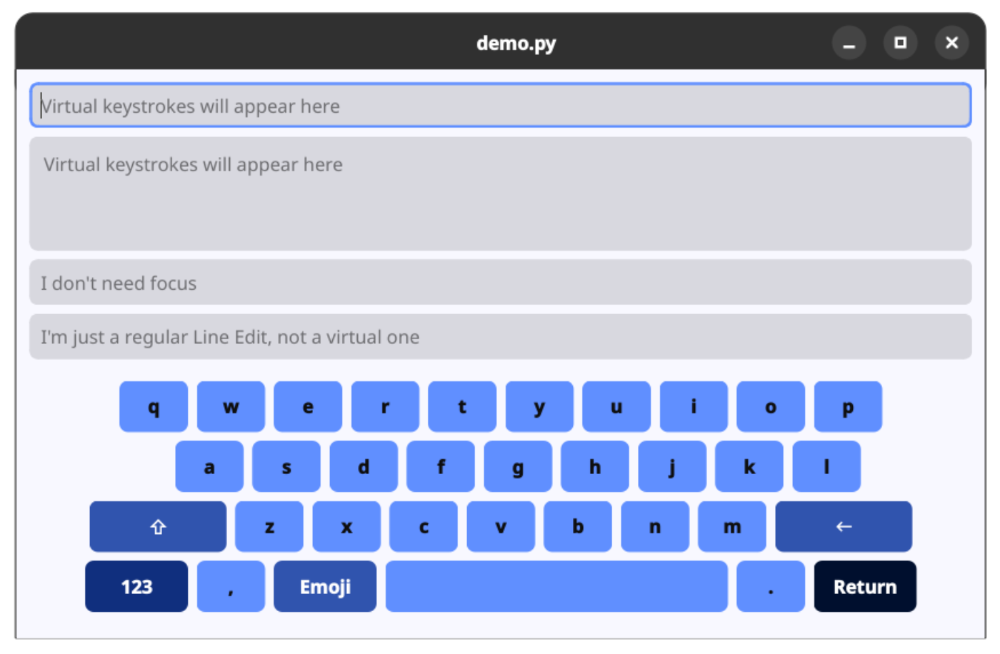

# Virtual Keyboard for PySide6

Virtual keyboard for PySide6 apps. This keyboard does not pretend to act like a physical keyboard, rather, it implements a `VirtualKeyEventBus` that can be customized for anything you want. Some pre-made custom widgets, `VirtualTextEdit` and `VirtualLineEdit` will hook into the event bus instead of the physical keyboard.

Additionally, a `GlobalKeyEventBus` is also provided, that will intercept any keyboard event from a `QMainWindow`. Some example use cases are HID barcode or RFID scanners.

## Features

* Customizable Layouts via XML
* Theming support via `style` XML attr
* Configure Line edit to only take virtual input and ignore physical keyboard
* Global input interceptor as event bus
* Virtual keyboard event bus

## To Do

* Support for more widgets
* Animations
* Floating keyboard
